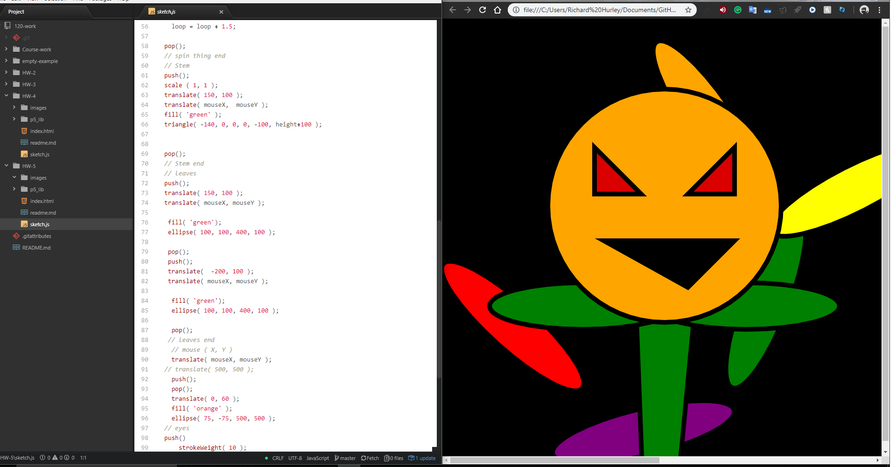

# Richard Hurley
-----
## Week 5 - Animation, Variables, & Mathn p5
---

 This week we were able to draw something in javascript and create a fun animation to it. It was interesting going into this projecte without a clue as to what i was going to do and then before i knew it hours had passed.

 This week I read all of the website information and watched the instruction videos. I learned how to use `frameRate()` , `noCursor()`, `mouseX, mouseY()`, and `let()`. 

 The only issues I had this week was knowing when to stop and work on my other homework. There are so many tweeks and Variables that can be changed that it can eat up an entire week.

I did not use the issues forum this week.

## Workspace Screenshot

