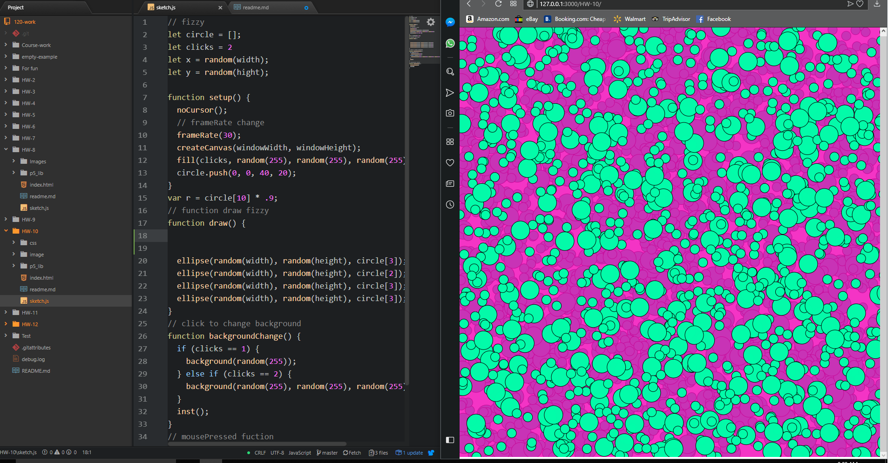

# Richard Hurley
-----
## Week 10 - Functions
---

 This week I read all the website information. I started trying to create a snow screen using a wallpaper .jpg but I couldn’t get it to work and before I knew it I had a different effect that reminded me of carbonation from a fizzy drink so i went with it. 

 I had one issue this week that caused me to lose my progress on this assignment and start over. This was my fault because I created a test file and when I test something and implement it i erase the test sketch.js and I erased the wrong file and closed the program for the night. Don’t do what Johnny Don’t Do does. This made me realize that my file organization could be better.  Next time I will open the test sketch in a new window so as I’m not confused by the tabs. 

I did not use the issues forum this week.

## Workspace Screenshot

