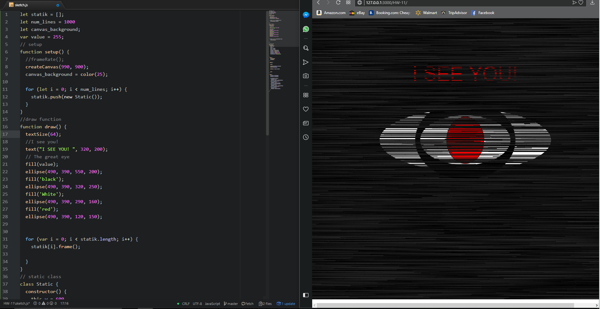

# Richard Hurley
-----
## Week 11 Intro to Object Oriented Programming (OOP)
---

 This week I read all the website information about object oriented programming and watched the videos on the class website. I started with the idea I was going to place balls on the screen and just have them bouncing around the screen. After I created the bouncy ball screen i started playing with the settings and relised that if I streach the balls thin and add so many it hart to tell what they are it created a static affect like from a scary movie so I changed the theme to a more sinister one. 

 I had no issues this week  

I did not use the issues forum this week.

## Workspace Screenshot

