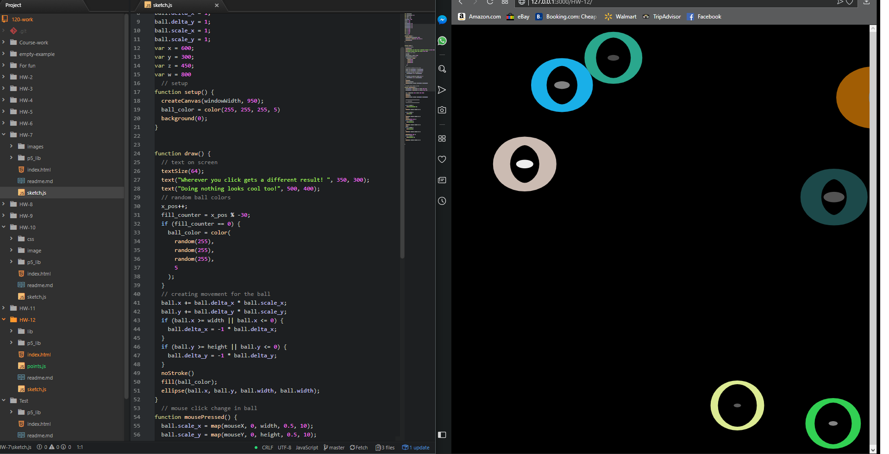

# Richard Hurley
-----
## Week 12 Object Awareness
---

 This week I read all the website information about object oriented programming and watched the videos on the class website. I enjoyed this project because making objects aware of each other is an awesome concept. I spent a lot more time on this code than I thought I would. I’m not sure why I start off with a ball concept and end up with something that looks like eyes.  

 I had no issues this week  

I did not use the issues forum this week.

## Workspace Screenshot

