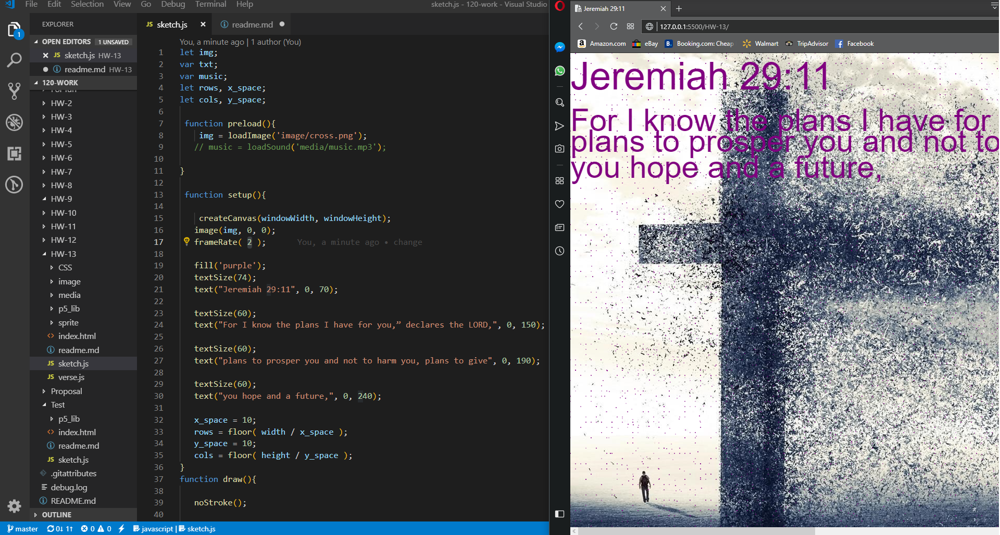

# Richard Hurley
-----
## Week 13 Final project
---

 For this project I wanted to do something that was a little inspiration to anyone on hard times.  Live hits us all hard and we sometimes think there is no purpose to the chaos. I wanted to create a game at first because I am a gamer myself. I changed my mind a lot during the brain storming process. I created this particular sketch because it hits home to me and my family personally. I was in the military and deployed to Iraq three times and the stuff I had to go through made me doubt my purpose in life. We all have a purpose and if you don’t see it now just know that there’s is a reason for all things good and bad. I feel as I progress through the years I will work on this project until it is completely how I imagined it. I hope to one day add many other verses and possibly music. I am in a worship team/band for my church and I would love to add this to the website when it is finished and possibly add out music recordings in the background. .  

### Work Process

 I did a lot of reading on code train to get some ideas. I also was inspired by the firefly example provided but I don’t feel mine is as cool as that one.  I also went back to review past assignments I created to see if there was anything I could recycle into this project. Unfortunately, I became sick with the flu last week and didn’t get much time to work on this.   

### Issues
I had an issue with creating a text that would auto adjust to fit in the screen no matter the size. I ended up creating 3 lines of text separately to avoid the text running off screen. 

## Workspace Screenshot

