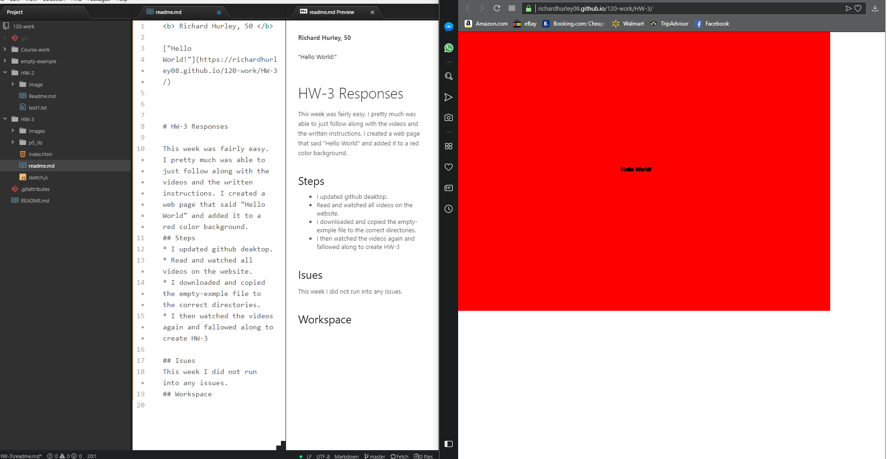

<b> Richard Hurley, 50 </b>

["Hello
World!"](https://richardhurley08.github.io/120-work/HW-3/)

# HW-3 Responses

This week was fairly easy. I pretty much was able to just follow along with the videos and the written instructions. I created a web page that said "Hello World" and added it to a red color background.
## Steps
* I updated github deaktop.
* Read and watched all videos on the website.
* I downloaded and copied the empty-exmple file to the correct directories.
* I then watched the videos again and fallowed along to create HW-3

## Isues
This week I did not run into any issues.
## Workspace

