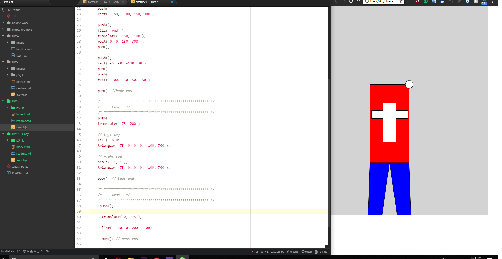

# Richard Hurley
-----
## Week 4 - Intro to Drawing in p5
---

 This week we were able to draw something in javascript. I had alot of fun on this assignment that I honestly forgot about all the other classes that I have. Obligations will get you every time.

 This week I read all of the website information and watched all the videos a few times. I downloaded the color packet to help with picking colors. I learned how to use `createCanvas()` and `background()` functions. 

 The only issues I had this assignment was typos. For example I wrote the camand `stroke ( 'white' )` but I forgot the ; at the end fo the command. I startet to think of it like texting  I have to wink after every command. ;)

I did not use the issues forum this week. 

## Workspace Screenshot

