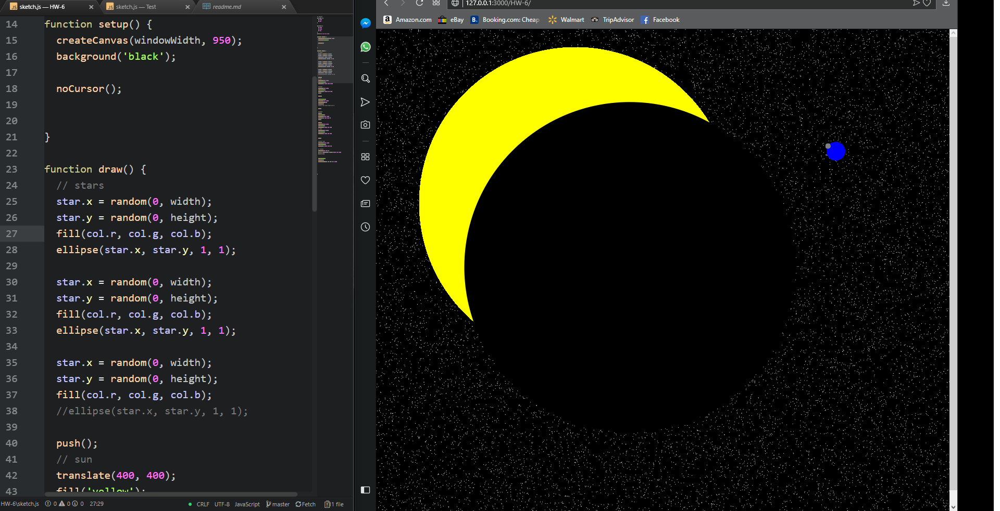

# Richard Hurley
-----
## Week 6 - Math, Strings, & Objects
---

 This week we were able to draw using math in javascript and create some form of automatic animation. It was a little difficult for me this projecte due to time and my imagination was limited do to medical issues in my family.

 This week I read all of the website information and watched the instruction videos.  

 The issues I had this week was getting the stars to randomly apear. I figured out that I forgot to setup where the random stars would apear.

I did not use the issues forum this week.

## Workspace Screenshot

