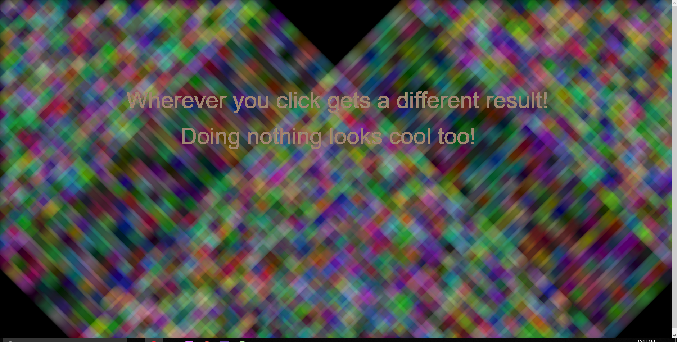

### Richard Hurley, Your Section Number

### [Live "Animation"](https://richardhurley08.github.io/120-work/HW-7/)

# HW 7 | Describe then Alter the Bouncing Ball

## Description of What the Original Code is Doing
<b>In the original code an object is made ball. Then the variables that describe ball are implemented. The ball is given the ability to move around the canvas according to the canvas variables (`windowWidth, 400`) the ball is set to bounce off the edge of the canvas in all directions.  There is a (`mousePressed`) event that causes the ball to change speed and direction.</b>

## How did you alter the sketch?

<b>I altered the code by adding random colors to the ball that range (`255, 255, 255`). I also added this same effect to the background but used a mouse clicking event. I made it so it looks to me like a quilt of you do nothing but watch.  I added text to the canvas that also slowly randomly change color that has a pulsating affect that I will admit was completely by accident do to the placement in the code, but I went with it. =) I had a project I scraped, and I decided to use it in this to create some random circles and ovals. The shapes change in positions, dimensions, and fill with different colors according to where the mouse is but it is only seen when the mouse click happens.</b>

## Workspace Screenshot

